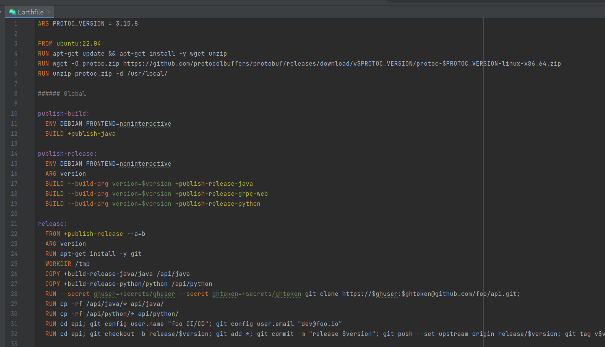
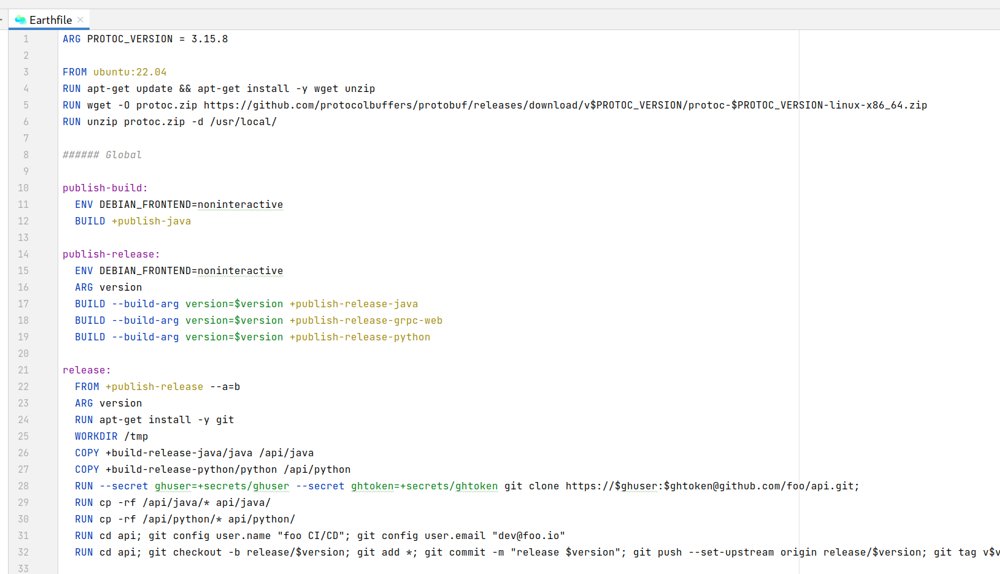

# earthly-intellij-plugin

IntelliJ plugin for Earthly language support. 

Check the currently released versions [on the JetBrains Marketplace](https://plugins.jetbrains.com/plugin/20392-earthly/versions).

## Features
- [x] Syntax highlighting for Earthfiles
- [ ] Code completion
- [ ] Formatter
- [ ] Commenter
- [ ] Go To Symbol Contributor
- [ ] ... Let us know!




## Requirements

This plugin is dependent on https://github.com/earthly/earthfile-grammar for syntax.

## Building
The following command generates a `earthly-intellij-plugin-<version>.zip` package in the current directory:
```
earthly +dist [--version=<version>]
```

For local development, this will generate a gradle wrapper (`gradle/`) corresponding to the gradle version used in the build itself:
```
earthly +generate-gradle-wrapper
```

## Signing (requires `earthly-technologies` org membership)
The following command generates a `earthly-intellij-plugin-signed-<version>.zip` package in the current directory:
```
earthly +sign [--version=<version>]
```

## Publishing (requires `earthly-technologies` org membership)
The following command builds, signs and publishes the plugin to the [IntelliJ Marketplace](https://plugins.jetbrains.com/plugin/20392-earthly):
```
earthly --push +publish --version=<version>
```

## Testing
```
earthly +ide
```

## Contributing

### Code of Conduct

Please refer to the [CNCF Community Code of Conduct v1.0](https://github.com/cncf/foundation/blob/main/code-of-conduct.md)

### CLA

#### Individual

All contributions must indicate agreement to the [Earthly Contributor License Agreement](https://gist.github.com/vladaionescu/ed990fa149a38a53ac74b64155bc6766) by logging into GitHub via the CLA assistant and signing the provided CLA. The CLA assistant will automatically notify the PRs that require CLA signing.

#### Entity

If you are an entity, please use the [Earthly Contributor License Agreement form](https://earthly.dev/cla-form) in addition to requiring your individual contributors to sign all contributions.